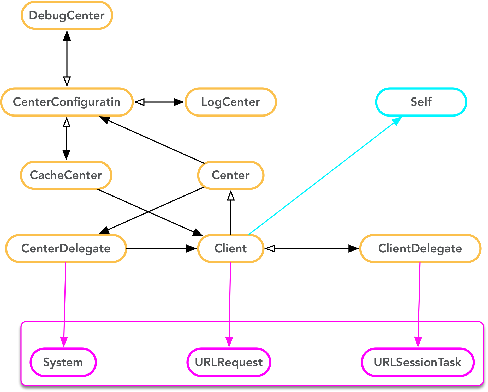
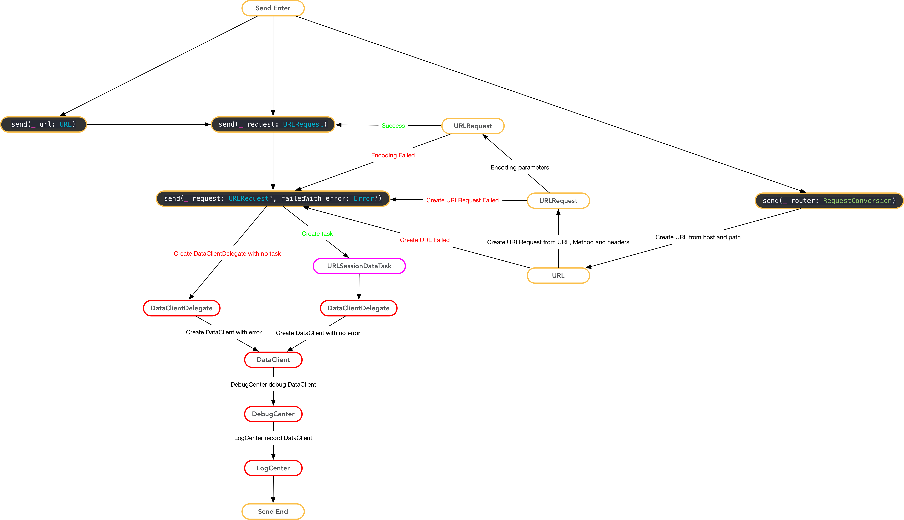

# Lotus


## Overview

Simple way to access network.

## Dependence

- [Alamofire](https://github.com/Alamofire/Alamofire)
- [SwiftyJSON](https://github.com/SwiftyJSON/SwiftyJSON)

## Installation

### CocoaPods

[CocoaPods](https://cocoapods.org/) is a dependency manager for Cocoa projects.

Specify Lotus into your project's Podfile:

```ruby
platform :ios, '8.0'
use_frameworks!

target '<Your App Target>' do
  pod 'Lotus', :git => 'git@github.com:XWJACK/Lotus.git'
end
```

Then run the following command:

```sh
$ pod install
```

### Carthage

[Carthage](https://github.com/Carthage/Carthage) is a simple, decentralized
dependency manager for Cocoa.

You can install Carthage with [Homebrew](http://brew.sh/) using the following command:

```bash
$ brew update
$ brew install carthage
```

To integrate Lotus into your Xcode project using Carthage, specify it in your `Cartfile`:

```ogdl
github "XWJACK/Lotus"
```

Run `carthage update` to build the framework and drag the built `Lotus.framework` into your Xcode project.

## Flow

[Lotus Graffle](./Documents/Lotus.graffle)

### Refrences



### Send Flow




### Receive Flow


## Usage

### Simple Usage

#### Make a request with URL

```swift
import Lotus

let url = URL(string: "https://httpbin.org/get")
Lotus.send(url)
```

#### Make a request with URLRequest

```swift
import Lotus

let url = URL(string: "https://httpbin.org/get")
let request = URLRequest(url: url)
Lotus.send(request)
```

#### Receive Response

`ResultConversion` define data to model.

> ⚠️ Only auto convert while using `generic` and `genericArray` call back.

```swift
struct UserModel: ResultConversion {
    
    let id: String
    let name: String
    let age: Int
    let cover: URL?
    
    init(json: JSON) {
        id = json["id"].stringValue
        name = json["name"].stringValue
        age = json["age"].intValue
        cover = json["cover"].url
    }
    /// Default is parse data from "data"
}
```

##### Receive Success Data

```swift
Lotus.send(router).receive(success: { data in
/// Receive response data with no error.
})
```

##### Receive Failed 

```swift
Lotus.send(router).receive(failed: { error in
/// Receive response with error.
})
```

##### Receive progress

```swift
Lotus.send(router).receive(progress: { progress in
/// Receive response with progress.
})
```

##### Receive response

```swift
Lotus.send(router).receive(response: {
/// Receive response
})
```

##### Receive raw data

```swift
Lotus.send(router).receive(rawData: { data in
/// Receive response with raw data.
/// ⚠️ It may be called more than once
})
```

##### Receive Raw JSON 

```swift
Lotus.send(router).receive(rawJSON: { json in
/// Receive response with json.
})
```

> ⚠️ Conflict with success call back.

##### Receive Generic

Model need to confirm `ResultConversion`

```swift
Lotus.send(router).receive(generic: { (model: UserModel) in
/// Receive response with custom generic.
})
```

> ⚠️ Conflict with success call back.

##### Receive Generic Array

Model need to confirm `ResultConversion`

```swift
Lotus.send(router).receive(generic: { (models: [UserModel]) in
/// Receive response with custom generic array.
})
```

> ⚠️ Conflict with success call back.

### Suggesting Usage

#### Discussion

##### RequestConversion

`RequestConversion` define request conversion.
`Request` define request content.

```swift
/// Struct for request.
public struct Request {
    
    /// Path for request.
    public let path: String
    /// Parameters for request.
    public let parameters: Parameters?
    /// Method for request.
    public let method: Method
    /// Encoding for request.
    public let encoding: URLEncoding
    /// HTTP Headers
    public let headers: Headers?
    
    /// Request struct
    ///
    /// - Parameters:
    ///   - path: Path for request
    ///   - parameters: Parameters for request, default is `nil`.
    ///   - method: Method for request, default is `get`.
    ///   - encoding: Encoding for request, default is `default`
    ///   - headers: HTTP Header for request, default is nil.
    public init(path: String,
                parameters: Parameters? = nil,
                method: Method = .get,
                encoding: URLEncoding = .default,
                headers: Headers? = nil) {
        
        self.path = path
        self.method = method
        self.parameters = parameters
        self.encoding = encoding
        self.headers = headers
    }
}
```

##### ResultConversion

`ResultConversion` define result convert.
`Result` define result parse way.

```swift
/// Struct for result
open class Result {
    
    /// Custom parse data, default is in "data"
    open var data: (JSON) -> JSON
    /// Custom error for failed call back, default is always no error.
    open var error: (JSON) -> Error?
    
    /// Struct for result
    public init(data: @escaping (JSON) -> JSON = { $0["data"] },
                error: @escaping (JSON) -> Error? = { _ in nil }) {
        self.data = data
        self.error = error
    }
}
```

> default parse data from `"data"`.
> 
> default with no custom service error.

#### Initlization Lotus with host.

```swift
Center.default.configuration.host = { return "https://httpbin.org" }
```

#### Make a APIRouter

```swift
enum APIRouter: RequestConversion {
    case search(query: String, page: Int)
    
    var request: Request {
        switch self {
        case let .search(query, page):
                return Request(path: "/search", parameters: ["q": query, "offset": 10 * page])
        }
    }
    
    @discardableResult
    static func send(_ router: APIRouter) -> DataClient {
        return Lotus.send(router)
    }
}
```

#### Send request

```swift
APIRouter.send(.search(query: "Lotus", page: 1))
```

### Advance Usage

#### Custom Parse Way

```swift
struct UserModel: ResultConversion {
static var result: Result {
        return Result(data: { $0["newData"] }, error: { _ in nil })
    }
}
```

> ⚠️ Only useful for `generic` and `genericArray` call back.

#### Custom Service Error

```swift
struct UserModel: ResultConversion {
static var result: Result {
        return Result(data: { $0["data"] }, error: { $0["code"] == 401 ? nil : LotusError.customError(...) })
    }
}
```

> ⚠️ If result error is not nil, it will call back with failed
> 
> ⚠️ Only useful for `generic` and `genericArray` call back.

#### Custom Debug Center

All connection will through this DebugCenter. You can sub `DebugCenter` to custom   netowork connection.

```swift
class CustomDebugCenter: DebugCenter {

    override func send(_ client: DataClient, error: Error?) -> DataClient {
    		/// Custom send network.
        return client
    }
    
    override func receive(_ task: URLSessionTask?, data: Data, error: Error?) -> (Data, Error?) {
    		/// Custom receive network.
        return (data, error)
    }
}
```

```swift
/// Set Debug center when initlization Lotus.
Center.default.configuration.debugCenter = CustomDebugCenter()
```

#### Custom Cache Center

```swift
class CustomCacheCenter: CacheCenter {
	  override func save(rawData data: Data?, withRawKey key: String) -> Data? {
        /// Custom data when cache will been saved into file, nil if no data to cache.
        return data
    }
    override func read(rawData data: Data?, withRawKey key: String) -> Data? {
        /// Custom data when cache will been readed from file, nil if no cache.
        return data
    }
    override func cache(byRawKey key: String) -> String {
        return key.md5() ?? "Error MD5 with \(key)"
    }
}
```

```swift
/// Set Cache center when initlization Lotus.
Center.default.configuration.cacheCenter = CustomCacheCenter()
```

#### Custom Log Center

```swift
class CustomLogCenter: LogCenter {
    override func save(_ log: Log, witTime logTime: TimeInterval) -> String {
    		/// Custom log formatter to file.
        return logTime.description + "," + log.raw.joined(separator: ",")
    }
    
    override func terminal(_ log: Log, witTime logTime: TimeInterval) -> String {
    		/// Custom log fromatter to terminal.
        return "☁️" + Date(timeIntervalSince1970: logTime).description + log.raw.joined(separator: ",")
    }
}
```

```swift
/// Set Log center when initlization Lotus.
Center.default.configuration.LogCenter = CustomLogCenter()
```

## Update:

| Time | Version | Update Details |
| ---- | ------- | -------------- |
| 2017-06-09 | 0.1.0 | 1. Init project |
| 2017-10-11 | 1.0.1 | 1. Fix crash when create `URLRequest` failed. <br /> 2. Don't send request when an error occur. <br /> 3. Need first debug after log when an error occur. |


